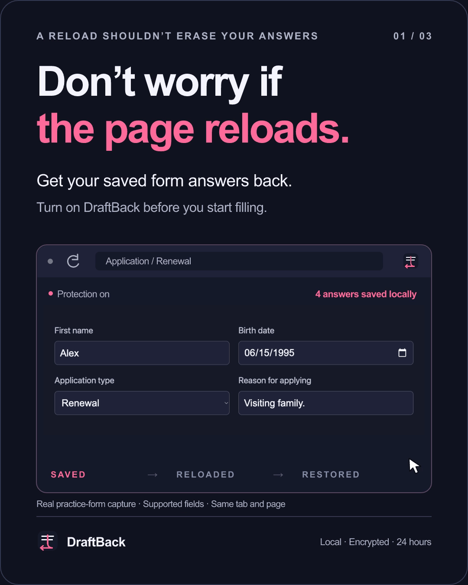
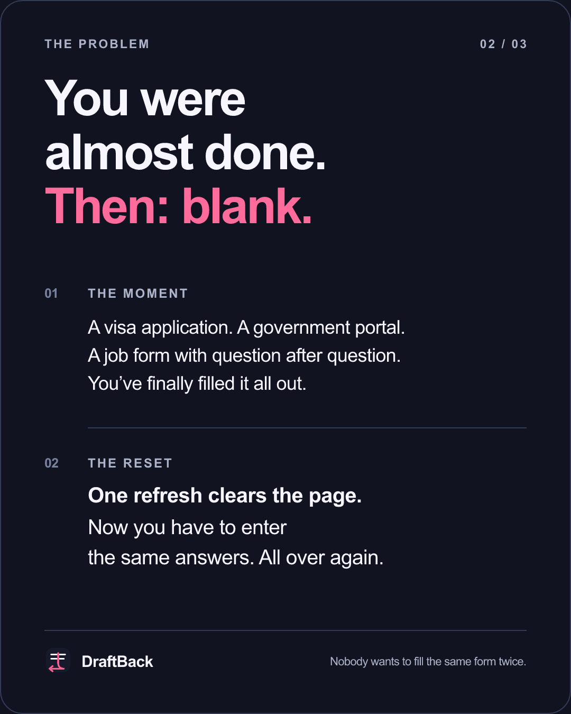
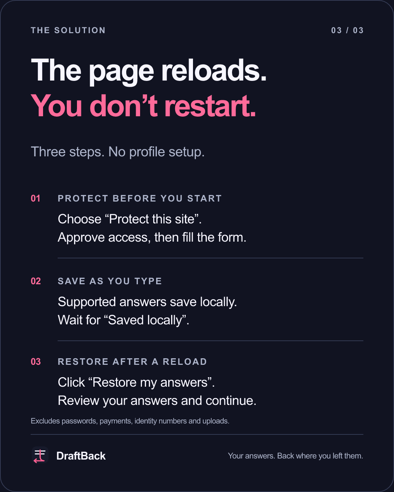

<p align="center"></p>

<h1 align="center">DraftBack</h1>
<h3 align="center">Don’t worry if the page reloads.<br>Get your saved form answers back.</h3>

<p align="center">For the answers you already worked to enter.<br>Protect before you start. Restore after a reload. Pick up where you left off.</p>

<p align="center">
  <a href="https://github.com/maka-tanmay/draftback/releases/download/v0.7.1/draftback-chromium-0.7.1.zip"></a>
</p>

<p align="center">
  
  
  
  <a href="LICENSE"></a>
</p>

<p align="center"><sub>Unpacked extension, not a browser-store installer. <a href="#get-draftback">Installation takes a few steps.</a></sub></p>

<p align="center"></p>

<p align="center"><sub>Real practice-form recovery with presentation overlays. Supported fields only, on the same tab and exact page.</sub></p>

<br>

## You were almost done. Then: blank.

The dates you checked. The addresses you looked up. The answer you rewrote three times.

A refresh should not mean doing that work again. DraftBack saves supported answers locally as you type on websites you choose, then offers to restore them after a reload.

This is **draft recovery**, not a tool that invents answers or fills an application from scratch. You enter the answers once. DraftBack helps you avoid entering them twice.

<p align="center">
  
  
</p>

<br>

## Get DraftBack

**1. Download and unzip.** Get the [DraftBack 0.7.1 ZIP](https://github.com/maka-tanmay/draftback/releases/download/v0.7.1/draftback-chromium-0.7.1.zip). Extract it into a permanent folder, not somewhere you will delete after installing.

**2. Open your browser’s extensions page.** Enter `chrome://extensions` in Chrome, `edge://extensions` in Edge, or `brave://extensions` in Brave. In Comet, use its Extensions page.

**3. Load the folder.** Turn on **Developer mode**, click **Load unpacked**, and select the extracted folder containing `manifest.json`.

**4. Pin DraftBack.** Open your browser’s extensions menu and pin it to the toolbar. The practice walkthrough opens automatically after installation.

No account. No profile to set up. No terminal required.

This release is for Chromium-based browsers. Safari and Firefox are not included. Managed browsers may block unpacked extensions; ask your administrator rather than bypassing that restriction.

<br>

## Protect once. Fill normally.

1. Open the form, click DraftBack, and choose **Protect this site**. Approve the browser’s website-access prompt.
2. Enter your answers normally. Wait for **Saved locally**.
3. If the page reloads, stay on the **same page in the same tab** and click **Restore my answers** in the page prompt or DraftBack popup.
4. Review the restored answers and continue. **Nothing is submitted automatically.**

Enable protection **before typing**. DraftBack cannot recover answers that disappeared before it was protecting the site.

Website access covers the site, not just one form. Stop protection when you finish.

<br>

## It shows you around

The first-install walkthrough highlights one action at a time. You try sample answers, reload a real practice page, and restore them. No real application or personal information needed.

Want to try it on a different page?

1. Open [RoboForm’s all-fields test](https://www.roboform.com/filling-test-all-fields).
2. Enable **Protect this site** and approve access.
3. Enter a few **fictional, non-sensitive answers** in ordinary fields.
4. Wait for **Saved locally**, refresh that tab, and click **Restore my answers**.
5. Check the result. Do not submit the form.

[Full installation, updating and troubleshooting guide →](INSTALL.md)

<br>

## Your answers stay on your device

No server, cloud sync, analytics or account. Drafts are encrypted locally and expire after **24 hours**. A **5 MB** storage limit can evict older drafts sooner.

Access is opt-in per website. Use **Privacy and settings → Delete site drafts** or **Delete all data** to clear saved information.

DraftBack tries to exclude passwords, payment/security details, recognized identity numbers, uploads and consent. These checks use field labels and types, so **they cannot detect every sensitive question**. Do not treat it as a passport-number vault or a permanent backup.

Restored answers are put back into the website, where that website can read them. Local encryption does not protect against an unlocked or compromised browser. [Read the privacy policy →](PRIVACY.md)

<br>

<details>
<summary><b>What works, and what to expect</b></summary>

### Supported answers

Short text, including a single character; long written answers; email, phone and URL fields; numbers; native dates and times; native single/multiple dropdowns; radio choices; ordinary checkboxes; and plain-text editable regions.

Conditional sections, rerendered fields, open shadow roots and accessible same-origin frames can recover when their fields remain uniquely identifiable. DraftBack preserves newer edits and nonempty written answers. It skips ambiguous matches instead of guessing.

### Important limits

- **Same tab, exact URL.** A different wizard route is a separate draft. Returning to an earlier exact route in the same tab can recover that route’s answers.
- **Wait for the save confirmation.** Saving is asynchronous. A crash before **Saved locally** can lose the last edit.
- **Not every portal.** Custom controls, closed shadow roots, cross-origin embedded forms, PDFs, changing field identifiers and inaccessible application stages may not recover.
- **No session or file recovery.** DraftBack does not restore a login session or re-upload files. New tabs, lost browser sessions and private/incognito windows are not supported recovery paths.
- **Sensitive fields are not the goal.** Passwords, recognized security/payment/identity fields, uploads, consent and hidden/disabled/read-only fields are excluded. Sensitive-field detection is heuristic.
- **Recovery does not need autofill.** A reusable profile is a separate, optional feature under **Optional autofill tools**.

Application examples describe the problem, not a guarantee that every visa, government or job portal is supported. No universal or 99% success rate has been established.

</details>

<br>

<details>
<summary><b>No restore prompt? Start here.</b></summary>

Check that protection was enabled before typing, **Saved locally** appeared, and you are on the same exact page in the same tab. Open DraftBack in the toolbar to check for **Restore my answers** there.

If the popup reports a connection error, preserve any answers still visible, reload the extension on your browser’s extensions page, then reload the form. **Do not uninstall the extension to troubleshoot:** removal deletes its stored data.

Slow or conditional fields may need a second Restore click after they appear. Unsupported fields still need manual entry. Drafts that expired, were evicted or were never saved cannot be restored.

[More troubleshooting and update instructions](INSTALL.md#if-recovery-is-unavailable)

</details>

<br>

<details>
<summary><b>Tested, with the boundaries published</b></summary>

The documented 0.7.1 verification includes **42 unit tests**, **19 browser form/privacy regressions**, **7 lifecycle checks** and **7 shipping-package checks**. Installed Comet recovery on RoboForm was also verified with fictional answers and no form submission.

These are regression results, not a real-world success percentage. Browser fixtures used preauthorized test hosts; a fresh native permission grant/deny prompt and complete authenticated government workflows were not verified by those tests.

[Verification report](PUBLIC-TESTING.md) · [Reliability method and limitations](RELIABILITY.md)

</details>

<br>

<details>
<summary><b>Build and test locally</b></summary>

With a recent Node.js version, no dependency installation is needed:

```sh
npm test
npm run check
npm run package:chromium
```

Browser regression scripts require an isolated development browser. Do not point them at your personal browser profile. See [RELIABILITY.md](RELIABILITY.md) for the setup and measurement boundaries.

</details>

<br>

<p align="center"><b>App 02 of 30 · Useful, open-source apps</b><br><sub>Previously: <a href="https://github.com/maka-tanmay/focal">01 · Focal</a></sub></p>

<p align="center"><sub>Made by <a href="https://github.com/maka-tanmay">Tanmay Maka</a> · <a href="https://github.com/maka-tanmay/draftback/issues">Something didn’t restore? Tell me</a> · <a href="LICENSE">MIT license</a></sub></p>
